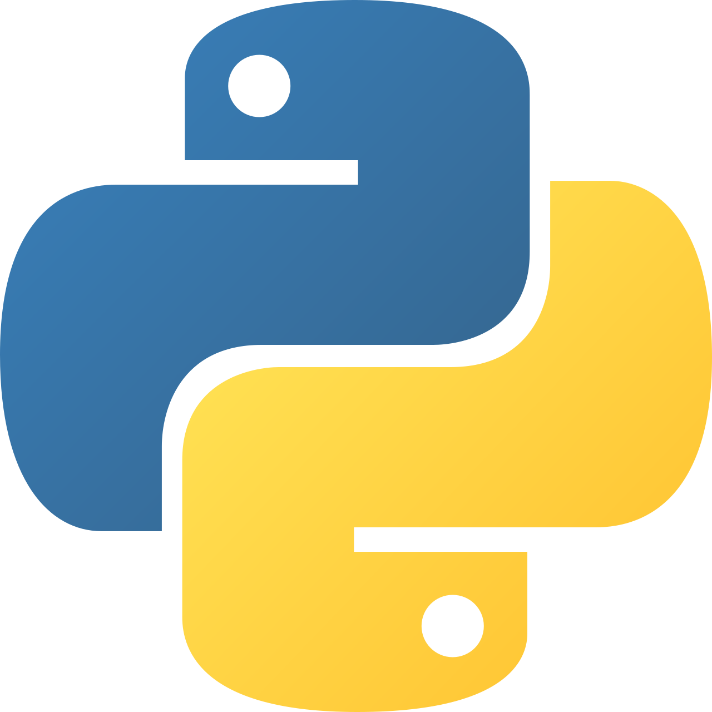

# Estudo Python
## Estudo da linguagem python para aplicação dos conceitos de lógica de programação
### logica de progamacao

<p aling="center">

</p>

### Utilizaçao do python
para usar a linguagem de progamaçao python, sera necessario
fazer a instalaçao da linguagem Abaixo o link para o 
danwload : 
<a href="https://python.org"> dawnload Python</a>

### utilização do Python no vs code
Depois de instalado o Python, você deve instalar a extensão
do Python:
<p align="center">

</p>

#### Primeiro comando em Python
 
``` python
 
print("Hello, World")

```